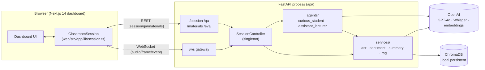
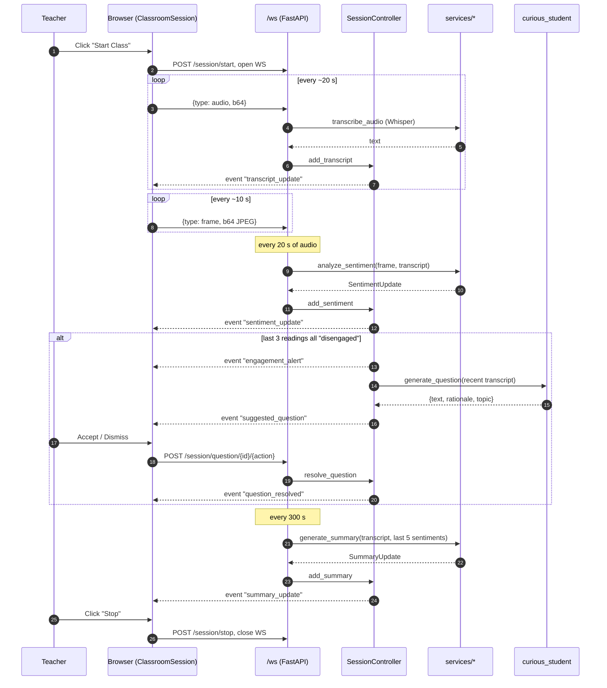
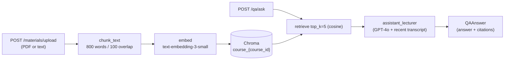

# Parrot Architecture

High‑level design of the Parrot Classroom Agent. Intentionally short; pair with the code in `api/` and `web/` for details. Update this file whenever a route, WebSocket event, service, or env var changes — see [Keeping this doc honest](#keeping-this-doc-honest).

> Companion to [`README.md`](./README.md), which covers setup and usage.

## Overview

Parrot is a **teacher‑facing** dashboard that observes a live class (mic + webcam), produces real‑time engagement readings, periodic summaries, and curiosity‑seeded questions, and answers ad‑hoc teacher questions grounded in uploaded course materials. It is single‑user, single‑process, in‑memory by design — see [Known limitations](#known-limitations).

**Non‑goals (v1):** student‑facing UI, multi‑tenant auth, recording storage, on‑prem model hosting, face anonymization (stub only).

## System context

## Components

### Frontend — `web/` (Next.js 14, App Router, TypeScript, Tailwind)

> ⚠️ See [`web/AGENTS.md`](./web/AGENTS.md): this is **not** the Next.js you may know from training data. Consult `node_modules/next/dist/docs/` before changes.

- `src/app/dashboard/page.tsx` — main teacher view, wires components to `ClassroomSession` events.
- `src/app/components/` — `VideoPreview`, `TranscriptPanel`, `SentimentTimeline` (Recharts), `SummaryPanel`, `SuggestedQuestionCard`, `AlertBanner`, `QAChat`, `CourseMaterialUploader`.
- `src/app/lib/session.ts` — `ClassroomSession` class: opens the WebSocket, captures mic via `MediaRecorder` (20 s chunks, `audio/webm;opus`), grabs a 640×480 JPEG **every 10 s**, and exposes `onEvent`, `requestSummary`, plus REST helpers `askQuestion`, `uploadMaterial`, `resolveQuestion`.

### Backend — `api/` (FastAPI, Python 3.11+)

- `main.py` — app entry, CORS from `CORS_ORIGINS`, router registration, startup hook that injects `agents.curious_student.generate_question` into the controller.
- `controller.py` — `SessionController` singleton holding `SessionState` (transcript, sentiments, summaries, suggested questions). Fan‑out via `register_listener`/`_emit`. Owns the engagement‑dip rule.
- `models.py` — Pydantic schemas: `SentimentUpdate`, `SuggestedQuestion`, `TranscriptChunk`, `SummaryUpdate`, `SessionState`, `QARequest`, `QAAnswer`, `MaterialUpload`.
- `routes/`
  - `ws.py` — WebSocket at `/ws`. Receives `{type: "audio"|"frame"|"force_summary"}`. Schedules sentiment every **20 s** and summary every **300 s** off the audio stream.
  - `session.py` — `POST /session/start`, `POST /session/stop`, `GET /session/state`, `POST /session/question/{id}/{accepted|dismissed}`.
  - `qa.py` — `POST /qa/ask` → `QAAnswer` with citations.
  - `materials.py` — `POST /materials/upload` (PDF or text → chunks indexed).
  - `eval.py` — `POST /eval/replay` for offline evaluation runs.
- `services/`
  - `asr.py` — OpenAI `whisper-1`, decodes webm/opus blobs.
  - `sentiment.py` — GPT‑4o multimodal (frame + recent transcript) → `score ∈ [-5,5]`, `label ∈ {engaged, neutral, disengaged}`.
  - `summary.py` — GPT‑4o over recent transcript + last 5 sentiment readings → `summary`, `key_points`, `sentiment_note`.
  - `rag.py` — Chroma persistent client at `CHROMA_DIR`; chunks 800 words / 100 overlap; embeds with `text-embedding-3-small`; one collection per `course_id`.
  - `anonymizer.py` — DeepPrivacy2 stub interface (deferred).
- `agents/`
  - `curious_student.py` — generates a single suggested question from recent transcript, optionally augmented with RAG hits.
  - `assistant_lecturer.py` — RAG‑grounded Q&A with source citations.

### External dependencies

- **OpenAI**: GPT‑4o (sentiment, summary, both agents), Whisper (`whisper-1`), `text-embedding-3-small`.
- **ChromaDB**: local persistent client at `CHROMA_DIR`, cosine HNSW.

## Real‑time data flow

The interesting interaction is the live class loop. The browser streams audio chunks and frames; the backend derives transcript/sentiment/summary, and triggers the curious‑student agent on a sustained engagement dip.

**WebSocket event names** (server → client, payloads = the matching Pydantic model unless noted):

| Event | Payload |
| --- | --- |
| `session_started` / `session_stopped` | `{session_id}` |
| `transcript_update` | `TranscriptChunk` |
| `sentiment_update` | `SentimentUpdate` |
| `summary_update` | `SummaryUpdate` |
| `engagement_alert` | `{ts, message}` |
| `suggested_question` | `SuggestedQuestion` |
| `question_resolved` | `{id, status}` |

**Engagement‑dip rule** (`controller._check_engagement_dip`): when the **last 3** `SentimentUpdate`s are all `disengaged`, emit `engagement_alert` and (if the session is active) trigger `curious_student` against the **last 300 s** of transcript.

## RAG flow

The curious‑student agent uses the same `retrieve` (`top_k=3`, query = tail of recent transcript) to optionally enrich its prompt.

## Configuration

Backend `.env` (loaded by `api/main.py`):

| Var | Purpose | Default |
| --- | --- | --- |
| `OPENAI_API_KEY` | All OpenAI calls | required |
| `CHROMA_DIR` | Vector store path | `api/data/chroma` |
| `CORS_ORIGINS` | Comma‑sep allowed origins | `http://localhost:3000` |

Frontend `web/.env.local`:

| Var | Purpose | Default |
| --- | --- | --- |
| `NEXT_PUBLIC_API_URL` | REST base | `http://localhost:8000` |
| `NEXT_PUBLIC_API_WS_URL` | WebSocket base | `ws://localhost:8000` |

Local dev: `uvicorn main:app --reload --port 8000` in `api/`, `npm run dev` in `web/`.

## Known limitations

- **In‑memory singleton state** (`controller.controller`). No persistence; restart loses the session. Not safe to run >1 backend replica.
- **No auth.** Single anonymous teacher; no per‑course isolation beyond `course_id` strings on RAG collections.
- **No reconnection/replay semantics.** A WS drop loses live events; the client does not catch up via `GET /session/state`.
- **Privacy.** `services/anonymizer.py` is a stub; raw frames are sent to OpenAI.
- **Observability.** Errors are `print(...)`; no structured logs, metrics, or tracing.
- **Cost / rate limits.** Sentiment fires every 20 s of audio, summary every 300 s; both call GPT‑4o. No backpressure.
- See `README.md` "Deferred (v2)" for product‑level deferred items (DeepPrivacy2, multi‑user auth, student UI, recording storage, on‑prem hosting).

## Keeping this doc honest

Update this file when you:

- Add or rename a route, WebSocket event, or `controller` listener payload.
- Add or replace a service or agent, or change which model it calls.
- Add or rename an env var (and update the table above).
- Change the engagement‑dip rule, sentiment cadence (20 s), summary cadence (300 s), frame cadence (10 s), or RAG chunk parameters.

For larger design changes (e.g. moving state out of process, adding auth), consider starting a `docs/decisions/NNNN-*.md` ADR; the directory doesn't exist yet — create it on first use.
